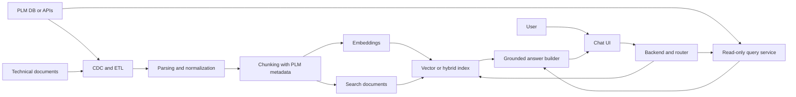
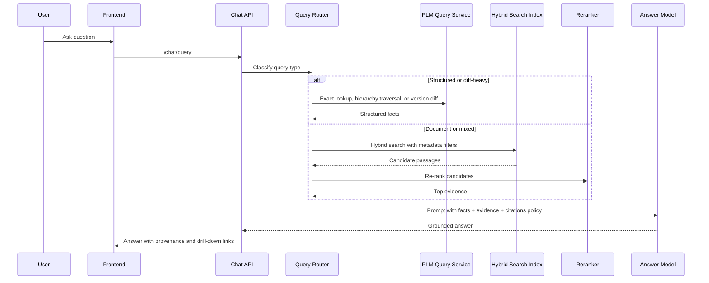
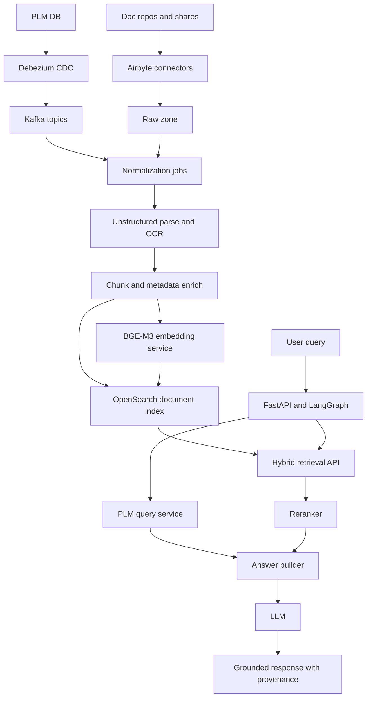

# RAG Chatbot and Orchestration Architecture for PLM Version and Component Control

## Restated task and executive summary

As I understand the task, you want an enterprise-grade design for a chatbot and orchestration framework that can answer questions about an electronic-device PLM domain in which electrical components roll up into semi-products, semi-products roll up into product models, models have versions, and even a single component change creates a new model version. The system must answer both structured questions about parts, assemblies, suppliers, and versions, and narrative questions grounded in technical documents such as specifications, ECO/ECR records, test reports, supplier documents, and work instructions. You also want a rigorous comparison between a simple prototype stack and a production-ready enterprise stack, including ingestion, retrieval, orchestration, security, deployment, monitoring, and evaluation, with a phased plan from prototype to production.

The core conclusion is that this should **not** be built as a “vector-search chatbot over PDFs.” It should be built as a **hybrid PLM assistant** with three coordinated capabilities: first, deterministic access to structured PLM facts through read-only database views or APIs; second, document retrieval over chunked technical content using embeddings and hybrid lexical/vector search; and third, workflow orchestration for ingestion, re-indexing, evaluation, and human review. That recommendation is supported by the capabilities of CDC tools such as Debezium and Airbyte, document parsers such as Unstructured, search stacks that support hybrid retrieval and document-level filtering such as OpenSearch, and retrieval frameworks that explicitly support metadata-aware routing and agentic retrieval. citeturn23view0turn21view0turn21view1turn21view2turn22view0turn9view0turn31search6turn23view3

For the **prototype**, I recommend a low-ops stack centered on a read-only PLM replica or reporting schema, Airbyte OSS for scheduled ingestion, Unstructured for parsing and chunking, OpenAI embeddings for fast time-to-value, PostgreSQL with pgvector for relational plus semantic retrieval, LangGraph for turn-level orchestration, FastAPI for the backend, Next.js/React for the UI, Keycloak or existing OIDC for SSO, and Docker Compose or a small Kubernetes footprint for deployment. This stack minimizes moving parts and is strong enough to prove accuracy, provenance, and operator workflow without major platform investment. OpenAI’s current embedding line supports shortened embeddings through a `dimensions` parameter, pgvector supports exact and approximate search with HNSW and IVFFlat, and LangGraph provides checkpointed state for long-running or human-in-the-loop flows. citeturn32view0turn32view1turn25view0turn12search0turn34view3turn15view1

For the **enterprise stack**, I recommend Debezium plus Kafka for durable CDC, Airbyte for non-database connectors, Unstructured for OCR-aware ingestion and element-level parsing, a self-hosted embedding/reranking layer built around BGE-M3 and TEI or vLLM, OpenSearch for hybrid retrieval plus metadata filtering and document-level security, Temporal for durable workflow orchestration, LangGraph for online tool routing, FastAPI behind an API gateway, Next.js for the UI, enterprise SSO through Entra ID or Okta plus SCIM-based provisioning, Kubernetes with Terraform and Argo CD for deployment, and OpenTelemetry, Prometheus, Grafana, and Langfuse for observability and evaluation. This stack is more complex, but it is much better aligned with PLM change rates, auditability, security boundaries, and operational durability. citeturn23view1turn23view2turn21view0turn21view1turn23view3turn30view1turn29search1turn29search12turn9view0turn9view1turn9view2turn9view3turn34view2turn15view1turn14search12turn14search0turn14search1turn17view0turn16search1turn16search6turn33view0turn33view3turn18search18turn19search20

The single most important design decision is to make **version-awareness** a first-class feature of the entire pipeline. Every chunk, embedding, and search document should carry PLM metadata such as `product_type`, `model_id`, `model_version`, `semi_product_id`, `component_id`, `supplier_id`, `effective_from`, `effective_to`, `source_system`, `document_version`, `checksum`, and `acl_tags`. Without that, the bot may retrieve a correct sentence from the wrong model version, which is operationally worse than returning no answer at all. Hybrid retrieval, metadata-aware filtering, and reranking are especially important here because identifier-heavy PLM queries combine exact-match fields with narrative engineering text. BGE-M3’s own model guidance recommends hybrid retrieval followed by reranking, OpenSearch exposes native hybrid-search pipelines, and LlamaIndex’s metadata-aware auto-retrieval pattern aligns well with structurally filtered PLM queries. citeturn23view3turn9view0turn31search6turn25view0

## Architecture principles for PLM-grounded RAG

A PLM assistant in this domain will face at least five distinct question types. Exact entity lookups such as “what supplier is approved for capacitor C-184 in model X v13?” should go to structured PLM queries. Hierarchy questions such as “where is component C-184 used?” should traverse component → semi-product → model → version relations. Diff questions such as “what changed between model v12 and v13?” should use explicit version-comparison tools, not pure semantic similarity. Narrative questions such as “why did the MCU change?” should combine PLM facts with ECO/ECR and technical-document retrieval. Compliance and traceability requests should always return provenance with source document IDs and direct drill-down links. In other words, the assistant should be treated as a **router and synthesizer across tools**, not as a single monolithic retriever.

That routing pattern is increasingly standard in modern RAG systems. LlamaIndex’s documentation explicitly separates retrieval from query engines and shows metadata-aware auto-retrieval, where a natural-language query is transformed into both a search string and metadata filters. LangGraph also distinguishes predetermined workflows from more dynamic agent patterns and provides persistence and interrupts for human approval when needed. These patterns fit PLM especially well because access paths are partly deterministic and partly semantic. citeturn31search8turn31search6turn12search15turn12search19turn34view3

The most important retrieval principle is **hybrid search**. Identifier-heavy PLM data behaves poorly under vector-only search: part numbers, supplier SKUs, revision codes, and exact version identifiers typically need keyword, filter, or SQL access. At the same time, engineering-change text, requirement prose, supplier notes, and troubleshooting procedures benefit from semantic retrieval. This is why both pgvector and OpenSearch explicitly point toward hybrid approaches, and why BGE-M3 recommends “hybrid retrieval + re-ranking” for RAG. citeturn25view0turn9view0turn23view3

Another design principle is **immutable indexing by version, mutable aliases for “current.”** When a component change creates a new model version, do not overwrite prior embeddings or prior search documents. Instead, create immutable versioned artifacts and maintain one or more aliases such as `current_model_version` or `released_version`. That simplifies auditing, rollback, reproducibility, and evaluation. It also reduces “silent semantic drift,” where an answer changes because the corpus changed even though the user asked about a historical version.

A related principle is **document-element preservation**. Unstructured’s partitioning model extracts typed elements such as `Title`, `NarrativeText`, `ListItem`, and `Table`, and its chunking layer retains original elements in metadata. That is especially valuable in PLM because tables, section headings, images, and page references often matter as much as plain text. The system should preserve table boundaries, title boundaries, original page numbers, and source pointers, then expose them in answer provenance. citeturn21view2turn22view0

## Prototype stack

The right prototype is one that proves three things fast: that the assistant can answer correctly against real PLM data, that it can show trustworthy provenance, and that it can survive normal content changes without manual babysitting. It does **not** need to solve every enterprise concern on day one.

| Layer | Prototype choice | Why this is the right prototype choice |
|---|---|---|
| Data ingestion | Airbyte OSS for scheduled database and document syncs, plus lightweight Python watchers for file shares | Fast time-to-value, good connector coverage, simple incremental replication model |
| Change detection | `updated_at` watermarks where available; CDC if the source supports it; file checksums and document-version IDs for files | Enough to keep a pilot corpus fresh without building a full event backbone |
| Database access | Read-only PLM replica or reporting views behind a small query service | Keeps writes impossible and lets you codify query patterns early |
| Query patterns | Exact part lookup, BOM expansion, “where used,” version diff, as-of version resolution | These are the minimum viable PLM tools |
| Parsing and preprocessing | Unstructured partitioning for PDF, DOCX, XLSX, PPTX, HTML, email, CSV, images | Good enough for most technical corpora, with OCR/table support where needed |
| Chunking | `by_title`, parent-child metadata, isolated tables, version-stamped chunk IDs | Better retrieval coherence than naive fixed windows |
| Embeddings | Managed embeddings via `text-embedding-3-large`, shortened to 1024 dimensions | High-quality retrieval with simpler operations and smaller storage |
| Vector store | PostgreSQL + pgvector + Postgres full-text search | Minimal operational sprawl; one store for app, metadata, and vectors |
| Retrieval | SQL router + vector search + keyword search + metadata filters | Prevents the “part-number hallucination” problem |
| Reranking | Start with a managed reranker or omit in sprint one if corpus is small | Keep complexity down until retrieval failure modes are visible |
| Orchestration | LangGraph for online flows; background jobs on a lightweight queue | Good enough for conversational state and operator checkpoints |
| Backend API | FastAPI with REST plus WebSocket streaming | Quick Python-first integration with LLM and retrieval libraries |
| Frontend | Next.js or React chat interface with provenance cards and PLM deep links | Fast to build and good enough for pilot users |
| Auth | Existing OIDC or self-hosted Keycloak, basic RBAC, user-to-group mapping | Lets the prototype land inside real enterprise auth patterns |
| Deployment | Docker Compose or small Kubernetes namespace | Low overhead |
| Monitoring | OpenTelemetry + Prometheus + Grafana + Langfuse | Enough to see latency, failures, token/cost, and bad traces |
| Evaluation | Small gold set, Ragas metrics, SME review loop, Langfuse datasets | Fastest way to measure whether answers are useful |

This prototype stack is attractive because its underlying components are straightforward and well documented. Airbyte supports log-based CDC with an initial snapshot followed by incremental syncs that track the current position in source logs, while also warning that production teams should think carefully about invalid CDC positions and often prefer “fail sync” over surprise re-snapshots on large datasets. Unstructured supports a wide range of source file types and explicitly separates partitioning from chunking, with `by_title` chunking preserving section boundaries and retaining original element metadata. pgvector keeps relational data and vectors in one Postgres system, supports exact as well as approximate nearest-neighbor search, and recommends combining vector search with full-text search for hybrid retrieval. citeturn21view0turn21view1turn21view2turn21view3turn22view0turn25view0

For embeddings, the best prototype default is OpenAI’s `text-embedding-3-large` using the shortening feature to bring vectors down to **1024 dimensions**. OpenAI explicitly states that the model can produce up to 3072 dimensions and supports shortening via the `dimensions` parameter, letting teams trade off quality against storage and latency. OpenAI also notes that these embeddings are L2-normalized, which means cosine similarity and Euclidean distance produce identical rankings; that simplifies distance-function decisions in a prototype. If cost pressure is unusually high, the lower-cost `text-embedding-3-small` is a reasonable fallback, but the stronger large model tends to be the safer starting point for mixed technical and multilingual corpora. citeturn32view0turn32view1

For orchestration, LangGraph is a strong prototype fit because it is designed for long-running, stateful workflows and persists graph state as checkpoints. That matters for chat-based tool use, operator review, and debugging retrieval mistakes. It is not, however, a full replacement for enterprise workflow engines that need durable retries across many background jobs and cross-service event flows; that is one of the clearest boundaries between the prototype and enterprise designs. citeturn12search0turn34view3

For the API/UI layer, FastAPI gives you a Python-native path to REST endpoints, security dependencies, and WebSocket-based streaming, which is enough for early chat streaming and action-level traceability. Keycloak is a good prototype identity choice because it is an OpenID Connect provider with production, Kubernetes, observability, and high-availability guidance, so you are not painting yourself into a corner if the prototype succeeds. citeturn15view2turn15view3turn15view0turn15view1

The main tradeoff in this stack is that it is **intentionally under-brokered**. It moves quickly, but ingestion is not yet truly event-driven, retries are less durable, and fine-grained security is still largely enforced in the query service and metadata filters. That is acceptable for a prototype, as long as you treat it as a learning system rather than as final architecture.

## Production-ready enterprise stack

The enterprise stack should be optimized for a different objective: not fastest time-to-demo, but **correctness under change, operational durability, access control, and auditability**. In a PLM environment, that usually matters more than shaving one or two weeks off initial delivery.

| Layer | Enterprise choice | Why this is the recommended production choice |
|---|---|---|
| Data ingestion | Debezium CDC from PLM DB into Kafka, plus Airbyte for non-database systems and document repositories | Stronger durability, lower staleness, clearer replay and backfill paths |
| Change detection | Row-level CDC, schema-change capture, file hashes, document revision IDs, impact-expansion jobs | Necessary for versioned PLM domains |
| Database access | Canonical read-only PLM query service over replica or official PLM APIs | Centralizes business logic, ACLs, and schema evolution handling |
| Query patterns | Entity lookup, BOM traversal, version diff, effectivity/as-of queries, change-history lookups | Core PLM operations should be deterministic tools |
| Parsing and preprocessing | Unstructured with OCR-aware strategies, table extraction, original element retention | Better grounding for complex technical documents |
| Chunking | Title-aware and table-aware chunking, parent-child chunks, explicit section/page metadata | Reduces retrieval drift and improves provenance |
| Embeddings | Self-hosted BGE-M3 at 1024 dimensions via TEI or vLLM-compatible serving | Better data control and strong multilingual/hybrid behavior |
| Reranking | Cohere Rerank or self-hosted BGE reranker via TEI | Important for precision on long candidate lists |
| Vector store | OpenSearch as the primary hybrid retrieval store | Combines keyword, vector, filters, snapshots, and document security in one system |
| Retrieval | Hybrid lexical + vector search with metadata filters and score fusion | Best fit for identifier-heavy technical corpora |
| Orchestration | Temporal for durable workflows; Kafka for events; LangGraph for online agent routing | Durable background automation plus controlled online reasoning |
| Backend API | FastAPI or split gateway/service design; Redis cache; rate limits at the gateway | Python-friendly AI integration while staying operationally disciplined |
| Frontend | Next.js enterprise UI, provenance, version selector, “open record” deep links, diff views | Makes trust visible to engineers and QA users |
| Auth | Entra ID or Okta for OIDC + SCIM; RBAC and ABAC enforced at API and search layer | Better fit for enterprise identity lifecycle and least privilege |
| Deployment | Kubernetes, GPU node pools where needed, Terraform, Argo CD GitOps | Portable and operations-friendly |
| Monitoring | OpenTelemetry, Prometheus, Grafana, Loki, Langfuse | Handles both classical ops and LLM-specific traces |
| Evaluation | Gold datasets, offline retrieval metrics, groundedness metrics, online A/B, human adjudication | Mandatory for safe rollout |

The ingestion layer is the largest structural upgrade. Debezium is purpose-built for change data capture: it streams row-level changes from databases, can perform an initial consistent snapshot, records ordering and offsets, and emits change events to Kafka topics. Its SQL Server connector records log positions and resumes after failures; its MySQL connector reads binlog operations and schema changes into Kafka topics as well. This is a much better fit than schedule-based polling when model versions and BOMs evolve continuously. Airbyte still remains valuable in the enterprise design, but chiefly for systems that are not good CDC sources themselves, such as file repositories and surrounding business systems. citeturn23view0turn23view1turn23view2turn21view0turn21view1

For document processing, Unstructured remains a solid recommendation even in production because it has broad file-type coverage, supports OCR-aware PDF and image partitioning strategies, and preserves original document elements. The difference in production is less about swapping the parser and more about wrapping it in better controls: layout-aware processing, page and section metadata, chunk lineage, failed-document quarantine, and acceptance tests for critical document classes such as ECO packets, supplier PDFs, and test reports. citeturn21view2turn21view3turn22view0

For embeddings, I recommend **BGE-M3** as the enterprise default when data-control and portability matter. Its model card states that it supports more than 100 languages, can process up to 8192 tokens, and can simultaneously support dense retrieval, sparse retrieval, and multi-vector retrieval. The same source also recommends “hybrid retrieval + re-ranking” in RAG, which is unusually aligned with PLM search. Serve it through TEI when you want a focused, embedding-first service with dynamic batching, Prometheus metrics, and OpenTelemetry support, or through vLLM when you want an OpenAI-compatible serving surface and broader GPU-serving standardization. TEI explicitly supports batched embeddings and rerankers, while vLLM documents continuous batching and OpenAI-compatible online serving. citeturn23view3turn30view1turn30view0turn29search1turn29search11turn29search12turn29search14

For ranking, adding a reranker is worth it in production. Cohere’s Rerank documentation states that rerankers sort text inputs by semantic relevance to a query and are commonly used to sort results returned from an existing search solution. TEI also supports reranker models directly through its `/rerank` endpoint, which makes a self-hosted option practical if security or cost policy disfavors managed reranking. In practice, enterprise PLM systems usually justify reranking because users often ask long, under-specified questions where the first retrieval stage over-fetches. citeturn24search3turn24search7turn24search11turn30view0

For the vector and hybrid-search layer, I recommend **OpenSearch** rather than a vector-only database. OpenSearch exposes vector search, hybrid-search pipelines, snapshots to shared filesystems or object stores such as S3 and Azure storage, and document-level security with parameter substitution and attribute-based access patterns. That combination is particularly valuable for PLM because you need keyword search over identifiers, filters over version and ACL metadata, and operational backup/recovery without stitching together many side systems. If your organization has a strong preference for a vector-native engine, Qdrant is a credible alternative because it supports collection snapshots and restore workflows, but OpenSearch is the stronger default when hybrid search, existing search operations, and document-level security are priorities. citeturn8view1turn9view0turn9view1turn9view2turn9view3turn27view0turn26search11

On orchestration, the enterprise pattern should be **Temporal for durable system workflows plus LangGraph for conversational tool orchestration**. Temporal’s workflow model is resilient by design and can continue for years even through infrastructure failures; its retry policies automatically handle retriable activity failures with exponential backoff. LangGraph, meanwhile, gives you checkpointed graph state and human interrupts at turn time. In plain language, use Temporal for ingestion, re-indexing, replay, and evaluation jobs; use LangGraph for the few seconds or minutes of decision-making that happen while a user is interacting with the bot. citeturn34view2turn11view1turn12search0turn34view3turn12search19

On identity and authorization, the enterprise system should integrate with the corporate IdP via OIDC and provision users and groups via SCIM. Okta’s documentation describes OIDC as an authentication standard built on top of OAuth 2.0, and both Okta and Microsoft document SCIM as a standard, REST-based user and group provisioning protocol. That matters because a PLM assistant should not invent its own user lifecycle. Search-side access control should not rely only on UI hiding; OpenSearch’s document-level security and parameter substitution features let you propagate user and role attributes into search-time filtering. citeturn14search12turn14search0turn14search1turn14search7turn9view2turn9view3

For deployment, Kubernetes is the right enterprise default because Deployments provide declarative updates for Pods and ReplicaSets, and Horizontal Pod Autoscaling automatically scales workloads to match demand. Terraform gives a portable infrastructure-as-code path across cloud and on-prem resources, and Argo CD provides GitOps-style drift detection and automatic or manual synchronization from Git to the cluster. This is a good fit for a system that combines API pods, background workers, search clusters, and sometimes GPU-serving nodes. citeturn34view0turn34view1turn17view0turn16search1turn16search6

## Comparison, risks, and governance

The high-level tradeoff between the two stacks is straightforward: the prototype is optimized for **speed of learning**, while the enterprise stack is optimized for **sustained correctness under change**.

| Dimension | Prototype stack | Enterprise stack |
|---|---|---|
| Cost | Lower initial cost | Higher initial cost, lower long-run operational risk |
| Complexity | Low to moderate | High |
| Scalability | Good for one business unit or one product family | Good for multi-team, multi-product, higher concurrency |
| Latency | Usually lower at small scale because the system is simpler | Can be low, but depends on routing, reranking, and auth layers |
| Security | Adequate for pilot if carefully scoped | Stronger support for least privilege, audit, and recovery |
| Maintainability | Easier to start, easier to outgrow | Harder to build, easier to operate responsibly at scale |
| Best fit | Initial proof, pilot, or narrow business domain | Long-lived internal platform |

The biggest operational risks are not exotic. They are mostly the ordinary failure modes of enterprise AI systems showing up in a PLM context.

**Data leakage** is the first major risk. The mitigation is layered: read-only service accounts to the PLM source; search-time ACL enforcement; group and user provisioning through enterprise identity; and, where managed model APIs are used, a clear vendor policy review. OpenSearch supports document-level security with user-attribute substitution, which is a strong search-layer control. If you do use OpenAI for the prototype embedding service, OpenAI states that API data is not used to train or improve models by default, but that still does not remove data-residency or third-party processing concerns for regulated programs. citeturn9view2turn9view3turn14search12turn14search0turn14search1turn32view0

**Stale embeddings** are the second major risk, and in a version-driven PLM system they are especially dangerous. The mitigation is to make re-indexing event-driven and impact-aware. Debezium provides the right raw signal for structured changes, Airbyte documents how CDC position loss should often fail rather than silently re-snapshot in production, and Temporal gives you a durable way to fan out re-embedding jobs for all impacted model versions, connected documents, and aliases. The key implementation rule is simple: never treat re-indexing as an afterthought cron job once you pass the prototype stage. citeturn23view1turn23view2turn21view1turn11view1turn34view2

**Hallucination and wrong-version grounding** are the third risk. The mitigation is architectural, not just prompt-based. Route exact PLM lookups to the structured query service. Use hybrid retrieval with hard metadata filters on version and access rights. Rerank candidate passages. Require grounded answers with evidence references. Refuse when evidence is weak or contradictory. BGE-M3’s hybrid-plus-rerank recommendation, OpenSearch hybrid search, and Ragas faithfulness metrics all point in the same direction: precision and grounding should be engineered into the pipeline, not retrofitted into a prompt. citeturn23view3turn9view0turn24search3turn18search9turn19search17turn19search23

**Model drift and prompt regressions** are the fourth risk. Langfuse is designed to trace prompts, retrieval steps, token usage, scores, and experiments, and its datasets and evaluation features fit regression testing well. Ragas provides metrics such as context precision, context recall, response relevancy, and faithfulness, which are directly relevant to RAG pipelines. Use those offline and then perform limited online A/B rollouts for prompt, retriever, reranker, or model changes. citeturn19search1turn18search12turn18search0turn19search0turn18search18turn19search4turn19search20turn18search1turn18search5turn19search3turn19search17turn19search23

**PII and regulated content** are the fifth risk. In many device companies, supplier contacts, internal employee names, cost data, or field-issue narratives may be sensitive. The mitigation is to classify fields before indexing, exclude clearly unnecessary sensitive columns from the search corpus, separate “searchable” from “displayable” metadata, and require the answer layer to fetch only what the user is allowed to see. Search ACLs help, but the more durable control is “do not index unnecessary sensitive fields in the first place.”

Monitoring and governance should cover both ordinary SRE concerns and AI-specific concerns. OpenTelemetry supports traces, metrics, and logs, Prometheus scrapes and stores time-series metrics, and Langfuse adds LLM-specific trace visibility on top. TEI can export Prometheus metrics and OpenTelemetry traces, while vLLM documents Prometheus-oriented metrics for production monitoring. In practice, that means you can build one cross-stack dashboard that covers API latency, CDC lag, parse failures, embedding queue depth, search latency, reranker latency, refusal rate, answer-faithfulness score, and cost per user session. citeturn33view0turn33view3turn19search1turn18search15turn30view1turn29search14

## Phased implementation plan and milestones

A sensible delivery plan has three phases. The objective is to validate the right things in the right order rather than to “build production from day one.”

| Phase | Priority | Typical duration | Core goal | Main deliverables |
|---|---|---:|---|---|
| Prototype | Highest | 6–8 weeks | Prove answer quality and provenance on a narrow PLM slice | Read-only PLM query service, document ingestion for one domain, hybrid chat UI, evaluation baseline |
| Pilot | High | 8–12 weeks | Prove operational usefulness with real users | More connectors, better ACLs, reranking, change-driven refresh, SME feedback loop, dashboards |
| Production | High | 12–20 weeks | Prove durability, security, and maintainability | CDC backbone, durable workflows, SSO + SCIM, GitOps, DR, alerting, release process |

In the **prototype** phase, keep scope narrow. Pick one product type, one or two document classes, and five or six canonical query patterns. Build the read-only PLM query service first, because the rest of the system depends on deterministic structured access. Then ingest and index the most valuable documents, expose provenance in the UI, and create a gold set of at least 100–200 representative questions. The prototype is successful if engineers can answer practical questions faster with the bot than without it, and if they trust the citations.

In the **pilot** phase, upgrade for real usage rather than broad usage. Add version-diff tools, “where-used” traversal, stronger metadata filters, a reranker, and a steady refresh process. Bring in enterprise identity and role mapping even if you do not yet implement full ABAC. Add Langfuse traces and Ragas-based offline scoring. At this stage, treat evaluation as part of the product, not as a data-science side task. That is also the right moment to validate whether users actually need graph-style impact analysis; if they do, add a graph projection later rather than pre-committing to a graph database before the evidence is there. citeturn18search18turn19search4turn19search20turn18search1turn19search17turn19search23

In the **production** phase, harden the platform. Replace or complement schedule-based ingestion with CDC and Kafka. Move background processes to Temporal workflows. Put the system on Kubernetes with Terraform and Argo CD. Enforce SSO, SCIM provisioning, and search-time DLS. Establish disaster recovery for search indexes and databases through snapshot or PITR mechanisms. Define operational SLOs, on-call ownership, deployment gates, and regression thresholds for retrieval and answer quality. Kubernetes Deployments and Horizontal Pod Autoscaling, Terraform plan/apply workflows, Argo CD sync and drift detection, OpenSearch snapshotting, and Temporal retries are all directly relevant to that hardening step. citeturn34view0turn34view1turn17view0turn16search1turn16search6turn9view1turn11view1turn34view2

My recommendation on effort is pragmatic. If the PLM schema is reasonably clean and the document estate is not chaotic, a **3–5 person team** can usually deliver the prototype. A pilot commonly needs **4–6 people** because security, UX, integration, and evaluation all become more serious. Productionization often needs **5–8 people** across platform, application, security, and domain-owner roles. Those numbers are estimates rather than fixed truths, and they vary sharply with data cleanliness, document heterogeneity, and review overhead.

The highest-priority implementation milestones are these. First, define the canonical PLM query service and the metadata schema that every chunk and answer will use. Second, prove that version-aware retrieval works on real questions. Third, make provenance visible in the UI. Fourth, automate refresh and evaluation. Fifth, harden security and deployment. If those five are done well, the rest of the platform is much easier to evolve.

**Open questions and limitations.** The final stack choice may still depend on three unresolved variables: the actual PLM platform and its API/replica capabilities, the dominant document types and OCR/table complexity, and the acceptable tradeoff between managed AI services and self-hosted models. If those factors turn out to be materially different from the assumptions above, the recommended products could change, but the architectural pattern should not: structured PLM access plus hybrid document retrieval plus durable orchestration remains the right shape for this problem.